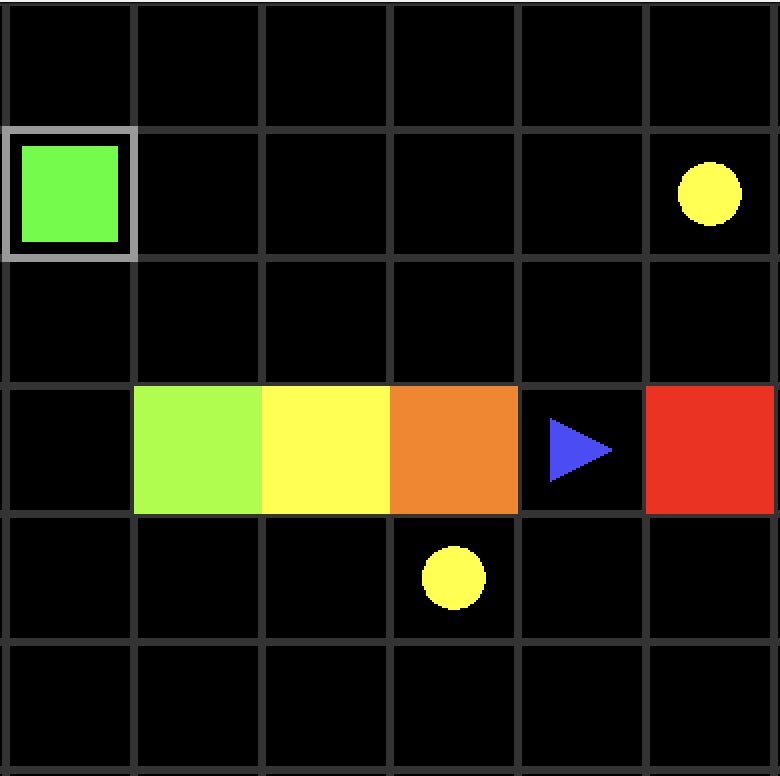

# Circuit Breaker

**Circuit Breaker** is a top-down grid-based puzzle game built with [LÖVE (Love2D)](https://love2d.org/).  
You control a modular repair drone that must restore power to damaged circuits while avoiding hazards and managing limited lives.

---

## 🕹 Gameplay Overview

- Power up grid tiles by repairing and activating wires.
- Equip and swap modular parts to change abilities.
- Avoid environmental hazards — you only have 3 lives!
- Reach the terminal by completing the circuit to win.

---

## 🔧 Controls

- Arrow keys: Move the drone
- `Space`: Use equipped tool (e.g., solder)
- `R`: Restart the current level

---

## 📁 Folder Structure
/circuit-breaker/
- main.lua – Game entry point
- conf.lua – LÖVE configuration
- src/
    - drone.lua – Player drone logic and UI
	- grid.lua – Tile grid system and power propagation
	- parts.lua – Drone part definitions (chassis, tools, chips)
	- pickup.lua – Part pickup system

---

## 🚀 Requirements

- [LÖVE 11.4+](https://love2d.org/) must be installed on your system

---

## 📦 Running the Game

 - See [this documentation](https://love2d.org/wiki/Getting_Started) titled Getting Started from [LÖVE wiki](https://love2d.org/wiki/Main_Page)